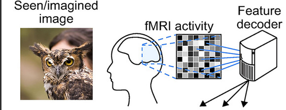

# Research Question aka what is this project all about?
The following sections will briefly introduce the research area and explain, how the hypothesis of this research project has been derived.

## Introduction to the study of mental imagery

<iframe src="https://giphy.com/embed/26gJyEfaxAQsuMFeo" width="480" height="270" frameBorder="0" class="giphy-embed" allowFullScreen></iframe>
<a href="https://giphy.com/gifs/southparkgifs-26gJyEfaxAQsuMFeo">via GIPHY</a>

This research project deals with the field of `visual mental imagery`. Mental imagery refers to the imagination of a certain object, scene, person etc., but can also relate to the imagination of sounds. In the following section, I will refer to visual mental imagery with `mental imagery`.
Where are those mental images coming from? What are the underlying mechanisms that explain those images? Mental imagery is tightly related to the so called "blackbox" frequently discussed in cognitive psychology. Simply because there seems to be no way to take a somewhat objective look into the mind of a person. The study of mental imagery is absurd, because on the one hand it seems almost impossible to study, while on the other hand it is something that everyone can relate to, except for persons that suffer from aphantasia ([Zeman et al., 2015](https://www.sciencedirect.com/science/article/pii/S0010945215001781?casa_token=Ad1leUlQgA8AAAAA:T5iGAVnFXdtLwX9kdoluttOZwwCVPHEGN0NrlxYOiyWtzOOVDQ3HHcK8_EnaYjgtv7oOMs_q5g)). Imagery gives richeness to introspective episodes, for example in memory or daydreaming and has been studied for over 140 years ([Galton, 1880](https://academic.oup.com/mind/article-abstract/os-V/19/301/2848572?redirectedFrom=fulltext&login=false)). Galton famously introduced the "breakfast-table-survey" to study mental imagery. However, since 1880 a lot changes in the field of cognitive neuropsychology. Especially neuroimaging methods lead to a breakthrough in studying the famous `blackbox`.

Nowdays, mental imagery is typically investigated by combining functional magnet resonance imaging (fMRI) and machine learning techniques. fMRI has the adavantage of a high spatial resolution, altough it comes with a poor temporal resolution. The given brain activity, recorded in the fMRI, can then be decoded through machine learning classifier. A popular approach would be to use a classifier like the logistic regression or the support vector machine. To decode brain activity means, in general, to classify brain activity into a given category. For example, a participant could look at cats and dogs in an fMRI experiment. Decoding in this example would mean that the machine learning algorithm could predict, whether the participant was looking at a dog or a cat, given the respective brain activity (i.e. the `voxel pattern`). In terms of mental imagery, the participant would imagine those images of a cat or dog. Decoding has been around many years and has been proven to work quite well, see [Naselaris et al., 2011](https://www.sciencedirect.com/science/article/pii/S1053811910010657?casa_token=1Uey6U2ByjwAAAAA:6qHcdw5hdNlKg6e-WymuGXcqPSg2zu648D_dCGAQNe5DEtIpaQp4h8DE-EdaCCbLw8DVA-uE9A).

(Shen et al., 2019)

To be a bit more neuroscientific, visual mental imagery involves both anatomical and functional parts of the visual cortex ([Pearson, 2019](https://www.nature.com/articles/s41583-019-0202-9)). It can be both voluntary and involuntary and depends on combined information retrieved from the memory system. When talking about decoding visual imagery, mainly the early visual areas are involved, meaning v1 and v2 ([Dijkstra et al., 2017](https://www.ncbi.nlm.nih.gov/pmc/articles/PMC6596858/)).
The question that will be answered in this research project is, whether the voxel pattern observed during mental imagery can be decoded. In machine learning terms: The algorithm is both trained and tested on the mental imagery voxel pattern. Mental imagery is an interesting research area, because it is more subjective than solely looking at given pictures. Just imagine (ha ha!) the difference in looking at a picture of this cute dog.

 

Everyone agrees, that this is how a dog looks. And you could probably imagine that everyone would recognize this picture of a dog after a week or two. But viewing objects in your mind is something different. It comes with far more difficulties, because you cannot control it as much. Thoughts are racing in ones mind, and it might be difficult to maintain mental focus. Already there are some studies that show that decoding from mental imagery is indeed possible ([Reddy et al., 2010](https://www.sciencedirect.com/science/article/pii/S1053811909012701?casa_token=lw6pq-cpWKwAAAAA:PAew2-UYG3rEqa4fU-dgZM3QuAq-JcgEE-_BLwpbfly0ewSrnT9nS7E05KAek0LKB8mOQxI0JQ)). The algorithm was trained and tested on imagery patterns, the test accuracies in this study were about 50%. Evidence that both perception and imagination share similiar voxel patterns was given. This was explained by the cross generalization, meaning, that the model was trained on the perception patterns and then tested on the imagery patterns and vice versa. Since the classification accuracies were above chance, the conclusion of the shared representational patterns was made by the authors. However, only four categories were shown and decoded. Would this also work with more categories? Leading to more cognitive load and thus reducing focus and might introduce more noise in the thought process.
Not only simple decoding of mental imagery but even whole reconstructions of those mental images are possible by using specific deep learning techniques ([Chen et al., 2022](https://arxiv.org/pdf/2211.06956.pdf)).
And the decoding of mental imagery stimuli does not stop there. [Horikawa et al. (2013)](https://www.science.org/doi/full/10.1126/science.1234330?casa_token=x-N93ozNsmMAAAAA:mHZIE6_913NkownqRAYvkZYEw6b9OYljipJq0ZWUW1hgTnZHaUjS1unafPOJskeIde_BXFZGpaOvWg) decoded the voxel pattern while participants were `dreaming`.

While this bit made clear, why mental imagery is investigated in this project, further motivation for the research question stems from the drive to learn more about neuroscience and combine this new knowledge with machine learning. This field of research is called `computational neuroscience`.

## Hypothesis - what to expect from this project?
The hypothesis answered in this research project is the following:
1. A machine learning classifier can predict a mental imagery given the respective voxel pattern with an accuracy atleast above chance.

Different classifiers are implemented and compared. Those are: Logistic regression, support vector machine and a fully connected neural network. All analyses are done in the awesome programming language `python`. The IDE used are `jupyter notebooks`.
The dataset used is open source and can be obtained from [openneuro](https://openneuro.org/datasets/ds001506/versions/1.3.1). The respective paper "Deep image reconstruction from human brain activity"(Shen et al., 2019) is also available [here](https://journals.plos.org/ploscompbiol/article?id=10.1371/journal.pcbi.1006633).

## References

 Chen, Z., Qing, J., Xiang, T., Yue, W. L., & Zhou, J. H. (2022, November 14). Seeing Beyond the Brain: Conditional Diffusion Model with Sparse Masked Modeling for Vision Decoding. arXiv. https://doi.org/10.48550/arXiv.2211.06956 

 GALTON, F. (1880). I.—STATISTICS OF MENTAL IMAGERY. Mind, os-V(19), 301–318. https://doi.org/10.1093/mind/os-V.19.301  

 Horikawa, T., Tamaki, M., Miyawaki, Y., & Kamitani, Y. (2013a). Neural Decoding of Visual Imagery During Sleep. Science, 340(6132), 639–642. https://doi.org/10.1126/science.1234330

 Naselaris, T., Kay, K. N., Nishimoto, S., & Gallant, J. L. (2011a). Encoding and decoding in fMRI. NeuroImage, 56(2), 400–410. https://doi.org/10.1016/j.neuroimage.2010.07.073 

 Pearson, J. (2019). The human imagination: the cognitive neuroscience of visual mental imagery. Nature Reviews Neuroscience, 20(10), 624–634. https://doi.org/10.1038/s41583-019-0202-9 [Titel anhand dieser DOI in Citavi-Projekt übernehmen] 

 Reddy, L., Tsuchiya, N., & Serre, T. (2010). Reading the mind’s eye: Decoding category information during mental imagery. NeuroImage, 50(2), 818–825. https://doi.org/10.1016/j.neuroimage.2009.11.084 

 Shen, G., Horikawa, T., Majima, K., & Kamitani, Y. (2019). Deep image reconstruction from human brain activity. PLOS Computational Biology, 15(1), e1006633. https://doi.org/10.1371/journal.pcbi.1006633

 Vividness of Visual Imagery Depends on the Neural Overlap with Perception in Visual Areas - PMC. (n.d.). Retrieved March 13, 2023, from https://www.ncbi.nlm.nih.gov/pmc/articles/PMC6596858/ 

 Zeman, A., Dewar, M., & Della Sala, S. (2015). Lives without imagery – Congenital aphantasia. Cortex, 73, 378–380. https://doi.org/10.1016/j.cortex.2015.05.019

